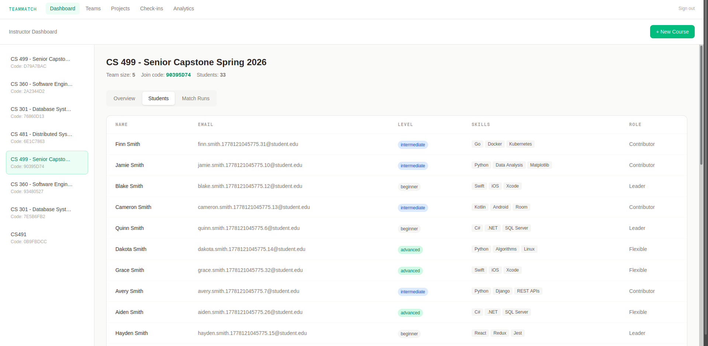
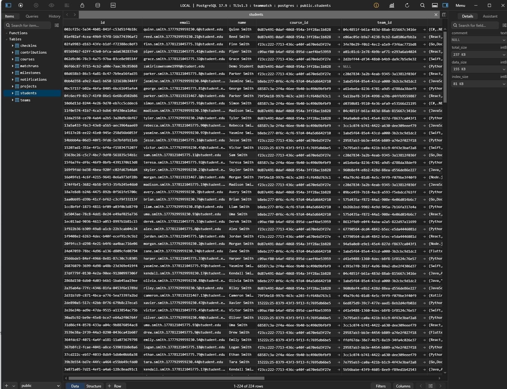
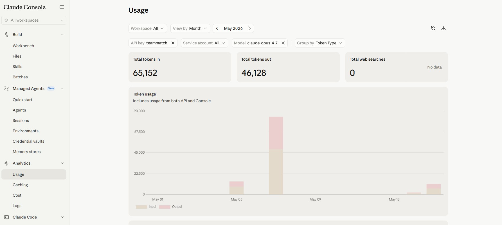
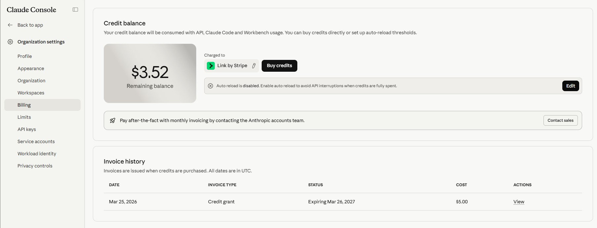

# TeamMatch

	
	
	

## Final Presentation

**[Final Presentation](./final%20presentation/)** — The final presentation slides are located in this folder.

## [Click Here to Watch Slides Presentation Recording](https://youtu.be/OD01qWfb_34)

## [Click Here to Watch demo on YouTube](https://www.youtube.com/watch?v=43uaMU5MOEs)

## [Full Project Documentation](./project%20documents/TeamMatch_Project_Documentation.txt)

## [Deployed on Vercel](https://teammatch-one.vercel.app/)
---

TeamMatch is a cloud-native web application that forms balanced, schedule-compatible project teams for computer science courses. It collects student skills and availability, then uses a deterministic optimization engine to generate fair, explainable team assignments for instructors.

## Tech Stack
- **Frontend:** Next.js (TypeScript, Tailwind CSS) → Azure Static Web Apps
- **Backend API:** FastAPI (Python) → Azure App Service
- **Database:** PostgreSQL → Azure Database for PostgreSQL
- **Job Queue:** Azure Service Bus
- **Matching Agent:** Python container → Azure Container Instances
- **CI/CD:** GitHub Actions → Azure

## Repo Structure
- `/frontend` - Next.js web application
- `/backend` - FastAPI REST API
- `/agent` - Matching engine and optimization logic
- `/infra` - Azure infrastructure configuration
- `/docs` - Architecture, PRD, and deployment documentation
- `.github/workflows` - CI/CD pipelines

## Features
- Student skill and availability survey
- Instructor-defined team constraints
- Deterministic team optimization engine
- Explainable team assignment summaries
- Async job processing for match runs

## Screenshots

Students table (backend):

Anthropic Claude Console - token usage:

Anthropic Claude Console - billing credit:

Student view (frontend - CS499):

